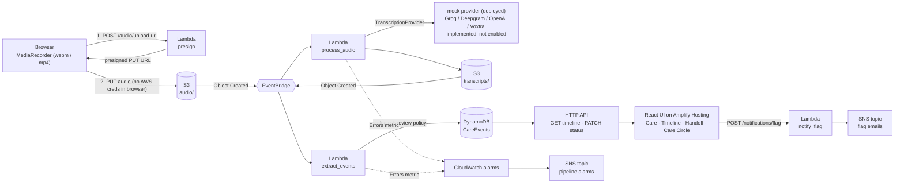

<div align="center">


# ElderLink

### Every voice note a caregiver sends becomes a trustworthy, evidence-backed care record, so no handoff starts from zero.

**Speak → transcribe → structure → verify → hand off.**
A serverless AWS pipeline, a safety-first data model, and a caregiver UI, running live.

**Live demo: https://main.d1q63nhpu2yil8.amplifyapp.com** (API: `https://zu35plf1yb.execute-api.us-east-1.amazonaws.com`)

`React + Vite` · `S3` · `EventBridge` · `Lambda` · `DynamoDB` · `HTTP API` · `SNS` · `CloudWatch` · `Amplify Hosting` · `AWS SAM`

</div>

---

## Live demo

| | |
|---|---|
| **App (public HTTPS)** | https://main.d1q63nhpu2yil8.amplifyapp.com |
| **API** | https://zu35plf1yb.execute-api.us-east-1.amazonaws.com |
| **Sample API call** | `GET /care-recipients/demo-dad/timeline` |
| **Hosting** | AWS Amplify Hosting (frontend) · AWS SAM stack `elderlink-audio-pipeline` in `us-east-1` (backend) |
| **Demo care recipient** | `demo-dad` |

**Try it in 60 seconds**

1. Open the app and go to **Timeline** (deep links work, e.g. `/timeline`).
2. Tap **Tap to speak**, record a short note and stop. It is uploaded straight to S3 and turns into a Care Event.
3. Open the event, review its evidence, and mark it **Verified** or **Keep uncertain**. The decision is saved to the backend.
4. In **Care Circle**, add a caregiver email, then flag an event. Confirm the one-time SNS subscription email, flag again, and the alert email arrives.

**Read this before judging:** the deployed stack runs the `mock` transcription and extraction providers, so a recording produces a canned sample transcript, not the words you spoke. There is no authentication (open demo API), and Care Circle and patients are stored in your browser. Details are in [Honest status](#honest-status).

## The problem nobody is building for

Family caregivers already share the most important information about an elder's day through **voice notes**: "he skipped lunch", "my sister said he fell". That information is scattered across WhatsApp threads, forgotten by the next shift, and impossible to search. Handoffs fail, and medications get doubled or missed.

Existing tools ask caregivers to stop what they are doing and fill in forms. They won't. **ElderLink meets caregivers where they already are: they just talk.**

## What ElderLink does

1. **Tap and speak.** A caregiver records a voice note in the browser.
2. **It becomes structured care events.** The audio is transcribed, and each claim is extracted into a typed **Care Event** (medication, symptom, appointment, concern, …).
3. **Nothing is silently trusted.** Every event links back to the exact transcript sentence it came from, and starts life as *needs verification*.
4. **A human decides.** The caregiver reviews the evidence and marks it verified or keeps it uncertain. The decision is **saved to the backend**, so it survives refreshes and reaches the next caregiver.
5. **The next shift sees what changed.** Care, Timeline and Handoff views read the same live API.
6. **The circle is kept in the loop.** Flagging an update can email the rest of the Care Circle, and one workspace can hold several patients. (See *Honest status* for what is deployed.)

## What makes it different: a trust model, not just a transcriber

Most "AI note-taker" demos stop at a summary. In caregiving, a confident-sounding wrong summary is dangerous. ElderLink's core is a data model designed around **not overclaiming**:

| Principle | How it is enforced in code |
|---|---|
| **Every claim cites evidence** | An event without a valid transcript-segment reference cannot be persisted (`core/care_event/validation.py`). |
| **Claims are not facts** | Each event carries `claim_stance` (asserted, uncertain, negated) and `source_type` (firsthand, secondhand). "He did **not** miss his pills" is a first-class event, not silence. |
| **AI never grants trust** | `review_state` and `verification_reason` are computed by a deterministic policy (`core/extraction/review_policy.py`), never taken from the model. Uncertain, secondhand, conflicting or weakly evidenced claims are flagged. Only a human action can make an event `verified`. |
| **Contradictions are preserved** | Conflicting statements become two separate events with a `conflicting_information` flag, not one invented "resolution". |
| **Humans write, narrowly** | The only write path is `PATCH …/care-events/{id}`. It accepts `verified` or `uncertain` and nothing else. The Lambda's IAM role is `dynamodb:UpdateItem` only, and other fields are immutable at the persistence layer. |
| **No medical advice** | ElderLink structures what caregivers said. It does not diagnose, prescribe or recommend. |

Read the reasoning in [`docs/care_event_schema.md`](docs/care_event_schema.md).

## Architecture



What is actually deployed (stack `elderlink-audio-pipeline`, `us-east-1`): one S3 bucket (private, versioned, SSE), two EventBridge rules, six Lambdas (`audio_upload_url`, `process_audio`, `extract_events`, `get_timeline`, `update_care_event_status`, `notify_flag`) plus two Lambda layers, one DynamoDB table (on-demand), one HTTP API, two SNS topics, two CloudWatch alarms, and the frontend on AWS Amplify Hosting (manual deploy of `frontend/dist`, with an SPA rewrite so deep links work).

Fully event-driven and serverless. Nothing sits idle on the backend, and the browser never holds an AWS credential or an API key.

### Swappable at every seam

Both AI stages sit behind small interfaces, so providers change with **one environment variable** and no code change:

| Stage | Interface | Providers |
|---|---|---|
| Transcription | `TranscriptionProvider` | `groq` (implemented, not deployed), `deepgram`, `openai`, `voxtral` (Amazon Bedrock), `mock` (deployed) |
| Extraction | `ExtractionProvider` | `mock` (deterministic rules, deployed), `bedrock` (implemented, not enabled) |

Every provider fails **loudly** with a safe, key-scrubbed error, and there is no silent fallback to mock. A failed transcription is recorded as `status: failed` and never becomes a fabricated event.

## Verified on the live AWS stack

- The deployed HTTP API serves the timeline (`GET /care-recipients/demo-dad/timeline`), and CORS preflights for the Amplify origin succeed on the timeline, upload-URL and notify routes.
- A presigned `PUT` from the deployed origin lands audio under `audio/`, which triggers `process_audio`, writes a transcript under `transcripts/`, triggers `extract_events`, writes a Care Event to DynamoDB, and the event appears in the timeline API.
- **Transcription and extraction currently use the `mock` providers**, so the transcript is a canned sample and not the words that were spoken. The pipeline wiring is real; the AI providers are not switched on (see below).
- Verify and Keep Uncertain decisions persist via the least-privilege PATCH Lambda.
- **498 automated backend tests**, with all HTTP mocked so none call a real provider. They cover every provider's error paths, key scrubbing and the full `process_audio` flow.
- A Care Event **evaluation harness** ([`evaluation/`](evaluation)) scores extractors against 16 hand-written golden cases covering negation, secondhand claims, contradictions and unsupported inference.

## Honest status

We would rather you hear our limits from us.

| Area | State |
|---|---|
| Voice → transcript | **Mock provider deployed.** The Groq, Deepgram, OpenAI and Voxtral providers are implemented and unit-tested, but the live stack returns a canned transcript. Real speech is not transcribed on the deployed stack. |
| Transcript → Care Events | Deployed with the **deterministic rule-based extractor**, which handles simple English caregiver phrasing. |
| LLM extraction / Voxtral (Amazon Bedrock) | Implemented and unit-tested, but **not enabled**: Bedrock model access is not yet verified for our account. Enabling it is a configuration change (`EXTRACTION_PROVIDER=bedrock`, `TranscriptionProviderName=voxtral`). We make no claim of live Bedrock use. |
| Audio format | Browsers record `audio/webm`, which Voxtral does not accept. The mock path is unaffected; a Bedrock/Voxtral switch would need a transcode step or a different provider. |
| Hindi voice notes | Not supported by the rule-based extractor (needs LLM extraction enabled). |
| Audio timestamps in the UI | Not displayed yet (`startTime` / `endTime` are null in the API). |
| Authentication | **None, by design for the hackathon.** The API is open, and anyone with the URL can read or write the demo care recipient (`demo-dad`). CORS restricts browsers, not other clients. |
| Care Circle and patients | Stored in the **browser** (`localStorage`), not the backend. They are per-device and are not shared between caregivers. The only backend-side Care Circle piece is the SNS email delivery. |
| Second demo patient | "Mom" only has data in mock-data mode; against the real backend she shows an empty timeline. |
| Flag emails | Each address must confirm an SNS subscription email once before it receives alerts. |
| Secrets | API keys are SAM `NoEcho` parameters injected only into the one Lambda that needs them. A production deployment should move them to Secrets Manager. |

## Try it

### Run the app

```bash
cd frontend
cp .env.example .env.local        # set VITE_ELDERLINK_API_URL to the deployed API
npm install
npm run dev -- --port 5173 --strictPort   # the backend allows this origin
```

No backend? Set `VITE_ELDERLINK_USE_MOCK_DATA=true` for a fully local UI on sample data.

Click **Tap to speak** and say something like:
*"My sister is ill today. She needs to see the doctor tomorrow."*
The new event appears with its evidence panel. Mark it verified, refresh, and it stays verified.

### Run the tests and the transcription smoke test

```bash
python -m venv .venv && .venv/bin/pip install pytest boto3
.venv/bin/python -m pytest -q                      # 498 passed

export GROQ_API_KEY=...                            # from your shell only, never committed
.venv/bin/python backend/scripts/test_transcription.py \
  --provider groq --audio-file path/to/any-short-recording.wav
```

### Deploy (AWS SAM)

```bash
bash infra/build_layer.sh && bash infra/build_extraction_layer.sh
sam build --template-file infra/template.yaml
sam deploy --stack-name elderlink-audio-pipeline --region us-east-1 \
  --capabilities CAPABILITY_IAM --resolve-s3 \
  --parameter-overrides TranscriptionProviderName=groq GroqApiKey="$GROQ_API_KEY"
```

`TranscriptionProviderName=mock` (the default) needs no key and is what the live stack runs.

For a hosted frontend, pass its origin so S3, the HTTP API and the Lambdas allow it (localhost:5173 is always allowed):

```bash
aws cloudformation package --template-file infra/template.yaml --s3-bucket <artifact-bucket> --output-template-file packaged.yaml
aws cloudformation deploy --template-file packaged.yaml --stack-name elderlink-audio-pipeline --region us-east-1   --capabilities CAPABILITY_IAM   --parameter-overrides FrontendOrigin=https://<your-frontend-origin> AlarmEmail=<you@example.com>
```

Frontend (AWS Amplify Hosting, manual deploy): build with `VITE_ELDERLINK_API_URL=<CareEventsApiUrl>`, `VITE_ELDERLINK_CARE_RECIPIENT_ID=demo-dad`, `VITE_ELDERLINK_USE_MOCK_DATA=false`, zip the contents of `frontend/dist`, then `aws amplify create-deployment` / upload / `start-deployment`. The Amplify app carries a rewrite rule sending extensionless paths to `/index.html` so React Router deep links work.

## Repository map

```
frontend/            React + Vite caregiver UI (Care · Timeline · Handoff · Care Circle)
backend/
  core/care_event/     Canonical schema, validation, normalization, TranscriptDocument
  core/transcription/  Provider abstraction + Groq / Deepgram / OpenAI / Voxtral / Mock
  core/extraction/     Extraction pipeline, review policy, conflict detection, Bedrock + Mock
  core/persistence/    DynamoDB repository and frontend DTOs
  lambdas/             audio_upload_url · process_audio · extract_events · get_timeline · update_care_event_status · notify_flag
infra/               AWS SAM template + layer build scripts
evaluation/          Golden cases + scoring harness for extractors
docs/                Architecture and Care Event schema rationale
demo/                Pre-written transcripts for a scripted live demo
```

## Safety boundary

ElderLink is **coordination software, not a medical device**. It never diagnoses, prescribes, recommends treatment or replaces professional judgment. It organizes what caregivers already said, attributes it to them, cites the evidence, and asks a human to confirm.

---

<div align="center">
Built in a hackathon for the people who quietly hold a family together.
</div>
